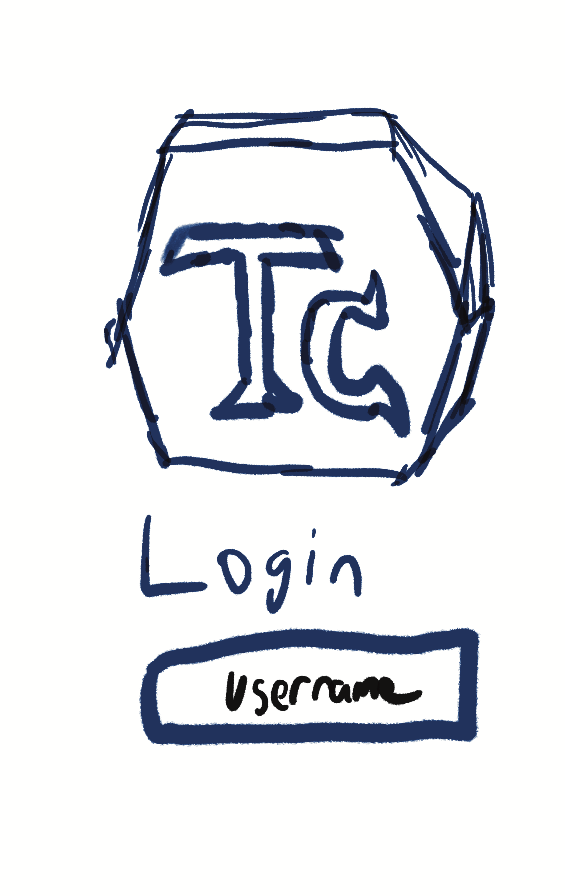
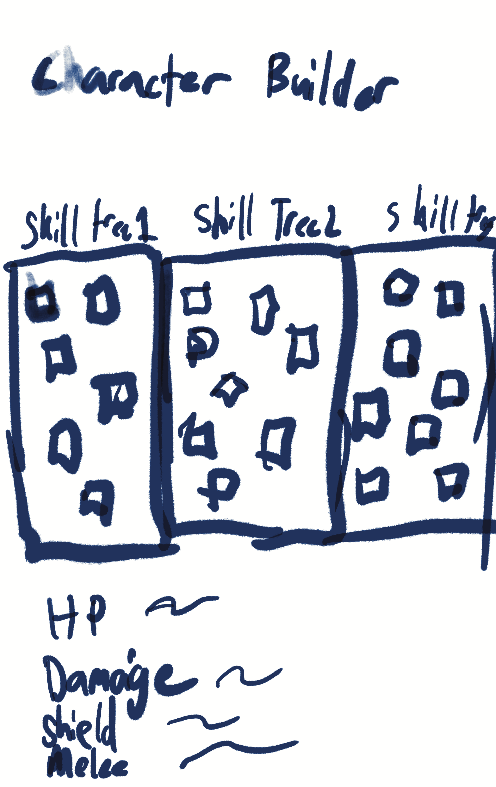
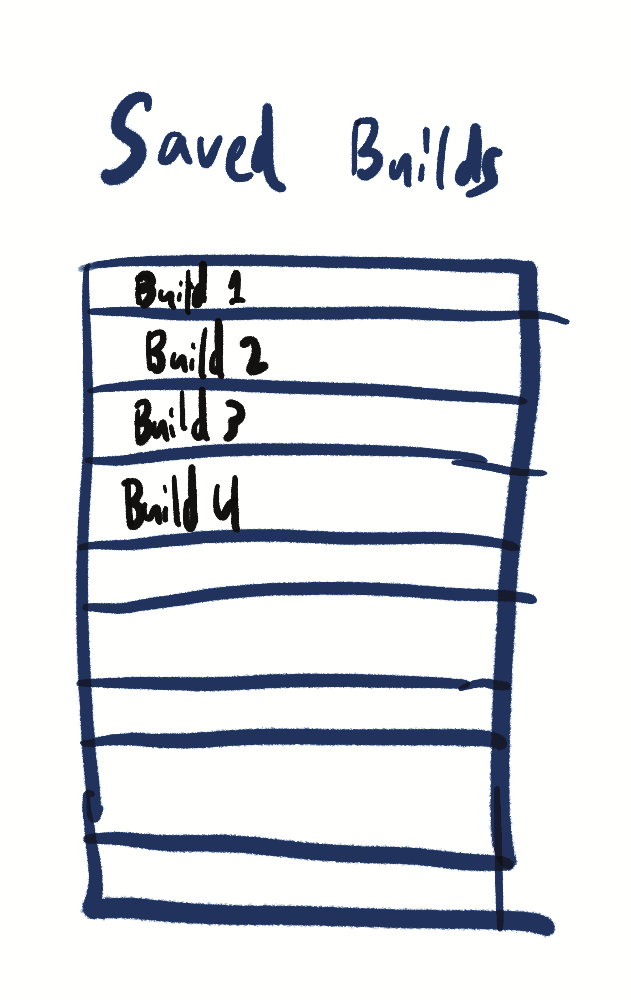
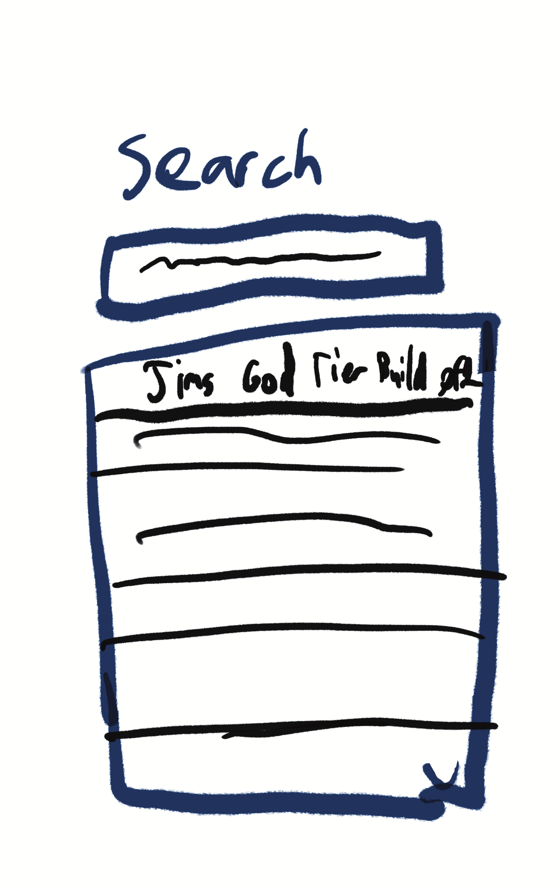

# __Theory Craft__

[My Notes](notes.md)

A brief description of the application here. Lorem ipsum dolor sit amet, consectetur adipiscing elit, sed do eiusmod tempor incididunt ut labore et dolore magna aliqua. Ut enim ad minim veniam, quis nostrud exercitation ullamco laboris nisi ut aliquip ex ea commodo consequat. Duis aute irure dolor in reprehenderit in voluptate velit esse cillum dolore eu fugiat nulla pariatur. Excepteur sint occaecat cupidatat non proident, sunt in culpa qui officia deserunt mollit anim id est laborum.

> [!NOTE]
>  This is a template for your startup application. You must modify this `README.md` file for each phase of your development. You only need to fill in the section for each deliverable when that deliverable is submitted in Canvas. Without completing the section for a deliverable, the TA will not know what to look for when grading your submission. Feel free to add additional information to each deliverable description, but make sure you at least have the list of rubric items and a description of what you did for each item.

> [!NOTE]
>  If you are not familiar with Markdown then you should review the [documentation](https://docs.github.com/en/get-started/writing-on-github/getting-started-with-writing-and-formatting-on-github/basic-writing-and-formatting-syntax) before continuing.

## 🚀 Specification Deliverable

> [!NOTE]
>  Fill in this sections as the submission artifact for this deliverable. You can refer to this [example](https://github.com/webprogramming260/startup-example/blob/main/README.md) for inspiration.

For this deliverable I did the following. I checked the box `[x]` and added a description for things I completed.

- [x] Proper use of Markdown: bolded and made heading for readme and uploaded images
- [x] A concise and compelling elevator pitch: Created an elevator pitch
- [x] Description of key features: Listed key features to be expected
- [x] Description of how you will use each technology: gave an explanation of how each technology is implemented
- [x] One or more rough sketches of your application. Images must be embedded in this file using Markdown image references. uploaded 4 images

### Elevator pitch

Have you ever spent hours playing a video game just to stare the at the absurd amount of upgrades or items you can apply to your character just to finally obtain it and realize it is __AWFUL!__ Well fear no more as with __Theory Craft__ you will no longer need to waste time any more. __Theory Craft__ will store the stats of items and skills so that you can plan out your characters build by being able to see your characters stats are without playing the game so you can waste less time testing out useless items and spend more time actually playing. Also for individuals who feel overwhelmed when it comes to building your character fear not as within __Theory Craft__ you can view other users builds and save them to be used as well.

### Design

### Key features

- Ability to save builds
- Ability to search up builds
- Seeing statline (ex current damage with gun and upgrades)
- A collection items within the game where you can see their stats

### Technologies

I am going to use the required technologies in the following ways.

- **HTML** - Uses an HTML page to login, page to make your builds, and another page to search for other builds
- **CSS** - Style webpage in a dark color scheme that will not flash bang you at night.
- **React** - Provides login, display of your builds, display of character builder, and dispay collection of other characters builds
- **Service** - Backend service with endpoints for:
      -login
      -retrieving builds
      -uploading builds
- **DB/Login** - Store users, users saved builds, all user builds in database. Register and login users. Redentials stored in database. Can't create your own build unless authenticated.
- **WebSocket** - As a build is uploaded this will be broadcasted for everyone to be able to view.

## 🚀 AWS deliverable

For this deliverable I did the following. I checked the box `[x]` created ec2 server and domain and linked them and setup the domain to use https

- [x] **Server deployed and accessible with custom domain name** - [[My server link](https://theorycraft117.click).

## 🚀 HTML deliverable

For this deliverable I did the following. I checked the box `[x]` and added a description for things I completed.

- [x] **HTML pages** - Created  5 html pages being index, characterBuilder, CommunityBuildes, savedBuilds, and about.
- [x] **Proper HTML element usage** - Demonstarted use of html by creating 5 pages using a variety of differnt htmls. A specific example is the use of a fieldset for the skilltree.
- [x] **Links** - I did not complete this part of the deliverable. Header allows the ability to switch between different pages as well as clicking on saved builds and community builds will open the character builder to see the build.
- [x] **Text** - Have text describing different parts and nameing parts for full implementation later.
- [x] **3rd party API placeholder** - placeholder appearing with the quote on the about.html page.
- [x] **Images** - Picture on the about.html page.
- [x] **Login placeholder** - login placeholder on the index.html and all other htmls pages have a placeholder for the user being logged in on the top right of each main section.
- [x] **DB data placeholder** - login will have a database of all the users, more prevalent placeholder is with community builds and saved build pages as they will store all the different build information
- [x] **WebSocket placeholder** - community builds are broadcasted to user for everyone to see

## 🚀 CSS deliverable

For this deliverable I did the following. I checked the box `[x]` and added a description for things I completed.

- [ ] **Header, footer, and main content body** - I did not complete this part of the deliverable.
- [ ] **Navigation elements** - I did not complete this part of the deliverable.
- [ ] **Responsive to window resizing** - I did not complete this part of the deliverable.
- [ ] **Application elements** - I did not complete this part of the deliverable.
- [ ] **Application text content** - I did not complete this part of the deliverable.
- [ ] **Application images** - I did not complete this part of the deliverable.

## 🚀 React part 1: Routing deliverable

For this deliverable I did the following. I checked the box `[x]` and added a description for things I completed.

- [ ] **Bundled using Vite** - I did not complete this part of the deliverable.
- [ ] **Components** - I did not complete this part of the deliverable.
- [ ] **Router** - I did not complete this part of the deliverable.

## 🚀 React part 2: Reactivity deliverable

For this deliverable I did the following. I checked the box `[x]` and added a description for things I completed.

- [ ] **All functionality implemented or mocked out** - I did not complete this part of the deliverable.
- [ ] **Hooks** - I did not complete this part of the deliverable.

## 🚀 Service deliverable

For this deliverable I did the following. I checked the box `[x]` and added a description for things I completed.

- [ ] **Node.js/Express HTTP service** - I did not complete this part of the deliverable.
- [ ] **Static middleware for frontend** - I did not complete this part of the deliverable.
- [ ] **Calls to third party endpoints** - I did not complete this part of the deliverable.
- [ ] **Backend service endpoints** - I did not complete this part of the deliverable.
- [ ] **Frontend calls service endpoints** - I did not complete this part of the deliverable.
- [ ] **Supports registration, login, logout, and restricted endpoint** - I did not complete this part of the deliverable.

## 🚀 DB deliverable

For this deliverable I did the following. I checked the box `[x]` and added a description for things I completed.

- [ ] **Stores data in MongoDB** - I did not complete this part of the deliverable.
- [ ] **Stores credentials in MongoDB** - I did not complete this part of the deliverable.

## 🚀 WebSocket deliverable

For this deliverable I did the following. I checked the box `[x]` and added a description for things I completed.

- [ ] **Backend listens for WebSocket connection** - I did not complete this part of the deliverable.
- [ ] **Frontend makes WebSocket connection** - I did not complete this part of the deliverable.
- [ ] **Data sent over WebSocket connection** - I did not complete this part of the deliverable.
- [ ] **WebSocket data displayed** - I did not complete this part of the deliverable.
- [ ] **Application is fully functional** - I did not complete this part of the deliverable.
